# Joke API Workshop with API Engine - Part 1

## Introduction

Welcome to the JOKE API Workshop. This session is designed for anyone interested in learning about the API Engine extension for Business Central. Whether you are new to APIs or looking to expand your knowledge, this workshop will provide you with practical experience and an understanding of API integration within a business environment.

Throughout this workshop, we will demonstrate the capabilities of the API Engine using the Free Joke API endpoint. Participants will gain hands-on experience with:

- Creating an API set, a crucial collection of operations for interacting with a specific API endpoint.
- Handling API messages to track and analyze the requests and responses during API interaction.
- Configuring API credentials, which are necessary for defining the endpoint URL within the API Engine, even for APIs that do not require traditional authentication.
- Overriding function URLs to customize and target specific API endpoints according to the needs of your business scenario.

This introductory session is the first part of the JOKE API Workshop series. By the end of this part, you will be equipped with the foundational skills needed to create and manage API calls using the API Engine Extension in Business Central.

To participate in this workshop, ensure you have access to a SaaS Business Central environment with the Suite Engine API Engine Extension installed. Detailed information and documentation for the Joke API endpoint can be found at [https://jokeapi.dev/](https://jokeapi.dev/). Additionally, our comprehensive YouTube tutorial series on the API Engine can be a valuable resource: [Joke API Video Tutorials](https://www.youtube.com/playlist?list=PLKxx1u9Yh-cQXcJURIWiAQAwePW70o3VQ).

## Requirements

To participate in this workshop, you will need access to a SaaS Business Central Environment where the Suite Engine API Engine Extension is installed.

## Create API Set

An API set is a collection of operations or functions that are designed to interact with a specific endpoint, allowing users to perform various actions or retrieve data through the API.

1. To create a new api set, use the search bar to navigate to the "API Sets" page.
   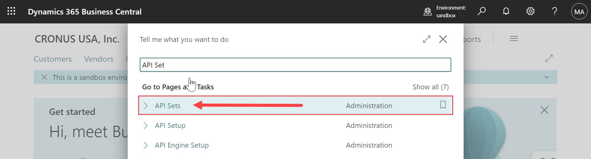
2. Open the API Sets page.
   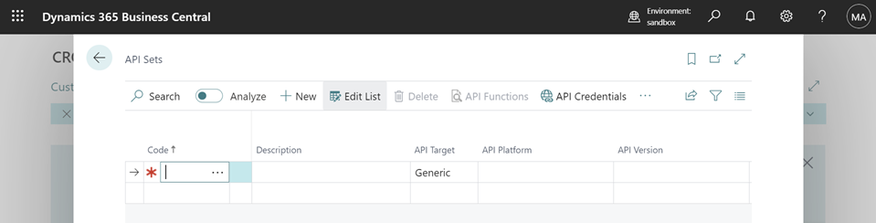
3. Create a new API Set by entering the following details:

   - Code: `JOKEAPI`
   - Description: `JokeAPI is a REST API that serves uniformly and well-formatted jokes.`
   - API Target: `Generic`
   - API Platform: `Joke`
   - API Version: `v2`
   - API Documentation URL: `https://jokeapi.dev/`
   - Request Message Encoding: `UTF8`
   - Response Message Encoding: `UTF8`

   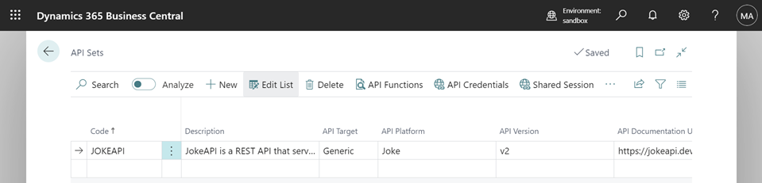

## Create Credential

Even though this API endpoint does not require credentials, a credential record is still necessary as the endpoint URL is defined within it.

1. On the API Sets Page, select the Joke API Set and click on the "API Credentials" button.
   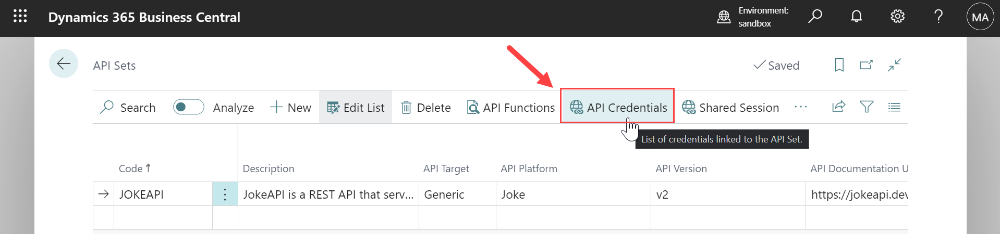
1. On the "API Credentials" page, click the '+ New' button to create a new record.
   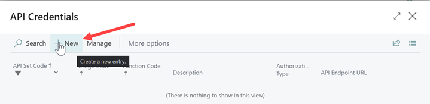
1. Enter the following information in the new credential record:
   - API Endpoint URL: `https://v2.jokeapi.dev/joke/Any?amount=1&safe-mode`
     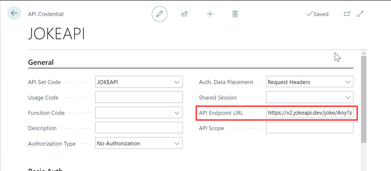

## Create Function

1. Return to the "API Set" list page, select the JOKEAPI Set, and click on the "API Functions" button.
   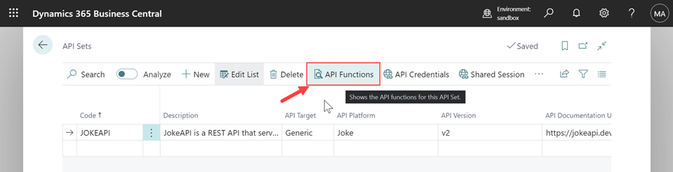
1. Create a new function within the API Set with these details:
   - Function Code: `GETONESAFEJOKE`
   - Description: `Retrieves a single joke that is considered safe for everyone.`
   - HTTP Method: `GET`
   - Buffer Processing Type: `JSON`
     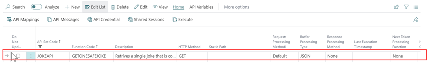

## Execute Function

1. Execute the `GETONESAFEJOKE` function by clicking the "Execute" action button in the Home group.
   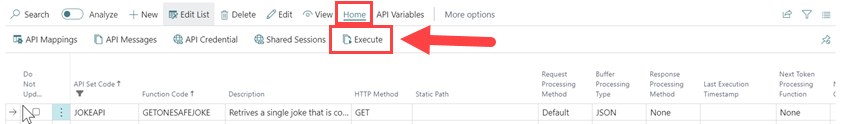

1. After the API call is executed, a popup message will appear, asking if you want to open the API Message. Click 'Yes' to view the message.

   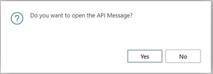

## API Message Card

The API Message Card contains detailed information about the API call. It shows when the API was initiated, the duration of the call, the HTTP response code, the request payload, the response, the endpoint, and more.

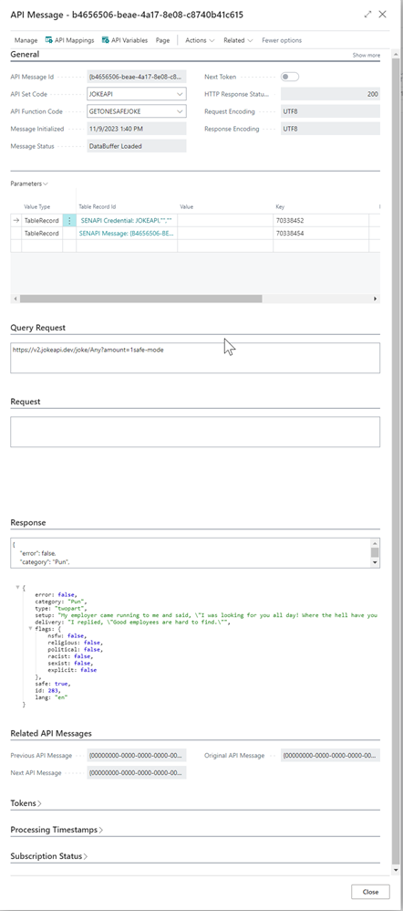

## Message Data Buffer

The response can also be viewed in the DataBuffer table. To view the message data buffer, go to the API Message card, then navigate to Related > Message Data Buffer.

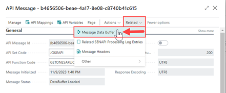
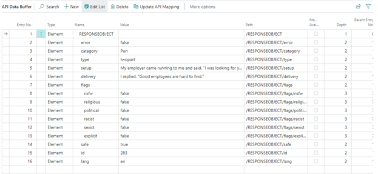

## Create a Second Function - URL Override

This section demonstrates how to override the URL endpoint for a specific API Function.

1. Go back to the "API Functions" list page for JOKEAPI.

1. Create a new function with the following details:
   - Function Code: `GETTENPROGJOKE`
   - Description: `Retrieves ten jokes from the Programming category, considered safe for everyone.`
   - HTTP Method: `GET`
   - Buffer Processing Type: `JSON`
1. Access the URL Override feature by clicking on the "API Variable" action group button, then select the "URL Override" button.
   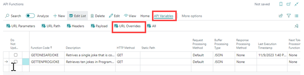
1. On the URL Override page, enter these details:
   - Name: `GetTenJokeURL`
   - Variable Value Type: `Text Value`
   - Value Processing Type: `Static`
   - Static Value: `https://v2.jokeapi.dev/joke/Programming?safe-mode&amount=10`
     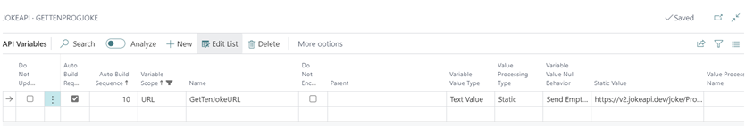
1. Close the URL Override page and return to the API Function List.

1. Execute the `GETTENPROGJOKE` function.

1. Open the API Message to review the response and data buffer.
