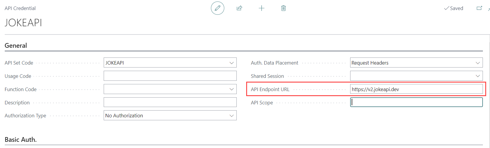
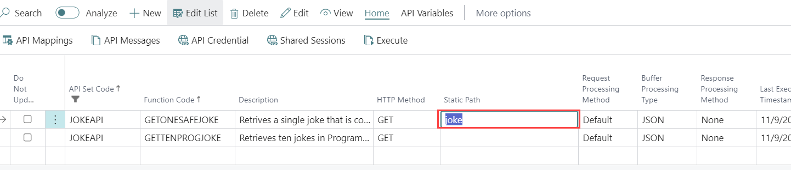
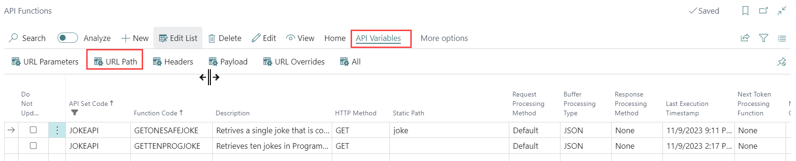
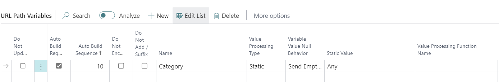
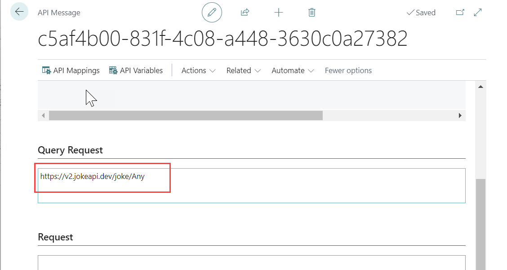
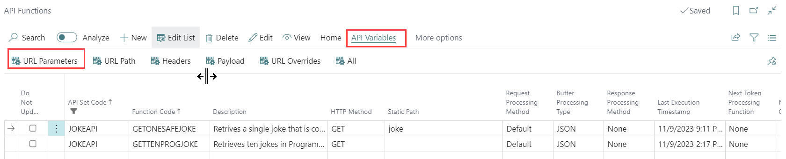
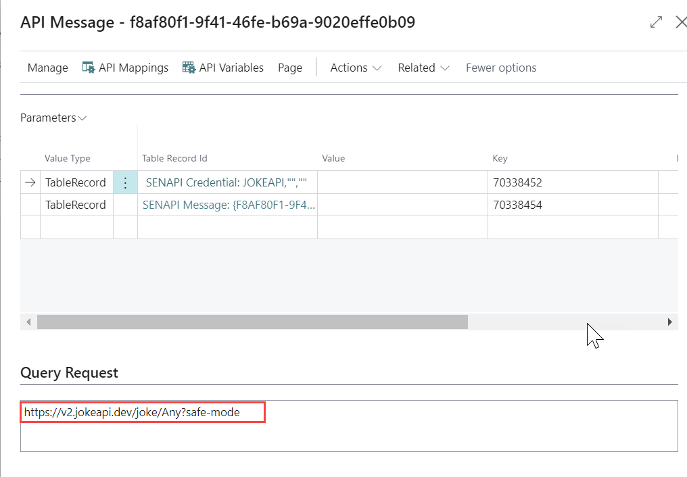
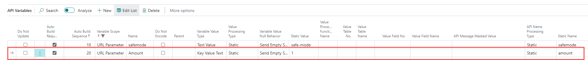

# Joke API Workshop with API Engine - Part 2

## Introduction

Welcome to Part Two of our six-part JOKE API Workshop series. This session continues the journey we started in Part One, delving deeper into the API integration process using the API Engine Extension in Business Central.

### Objectives

- Gain a foundational understanding of static URL construction and its components.
- Learn the process of copying an API Function for efficient reuse or modification.

## Requirements

Before participating in this workshop, you should have:

- Completed Part One of the series.
- Access to a SaaS Business Central environment with the Suite Engine API Engine Extension installed.
- Created an API Set and Function as part of The Joke API Part 1 workshop.

For a quick refresher or more information, the detailed documentation for the Joke API endpoint is available at [https://jokeapi.dev/](https://jokeapi.dev/). Additionally, you may find our YouTube tutorial series on the API Engine a valuable resource: [Joke API Video Tutorials](https://www.youtube.com/playlist?list=PLKxx1u9Yh-cQXcJURIWiAQAwePW70o3VQ).

## URL Endpoint Structure

A typical URL endpoint structure can be broken down into the following components:

`{Base URL}/{Path}/{Query Parameters}/`

For example:

`https://v2.jokeapi.dev/joke/Programming?safe-mode&amount=10`

Here, we have:

- Base URL: `https://v2.jokeapi.dev`
- Path: `joke/Programming`
- Query Parameters: `safe-mode&amount=10`

## API Credential - Base URL

In the previous workshop, we entered the full URL endpoint in the credential record. Now, we'll update the endpoint URL in the credential record to include only the Base URL. The Path and Parameters will be constructed using variables.

1. Navigate to the credential record created in the previous workshop. To open the "API Credential Card", go to the "API Set" page and click "API Credentials".
   
1. Edit the "API Endpoint URL" to remove the Path and Query Parameters, leaving only the Base URL.
   - API Endpoint URL: `https://v2.jokeapi.dev`
     

After making these changes, if you attempt to execute the `GETONESAFEJOKE` function and view the API Message, you'll notice the response section does not contain any jokes. This is because the API call is not directed to the full, correct endpoint or is missing parameters. Inspecting the "Query Request" section in the API Message will reveal the exact URL from the Credential record, which is now missing the necessary Path and Parameters.

However, executing the `GETTENPROGJOKE` function should yield the correct response. This function works as expected because we established a URL Override with the necessary Path and Parameters in the previous workshop.

## API Function - URL Path

To define the URL Path and Query Parameters within the API function record, follow these steps:

1. In the API Function list, set the value of the "Static Path" for the `GETONESAFEJOKE` function to `joke`.

   - Static Path: `joke`
     

2. To define the URL Path for the `GETONESAFEJOKE` function, navigate to 'API Variables' > 'URL Path'.
   

3. Create a new URL Parameter record with the following details:

   - Name: `Category`
   - Value Processing Type: `Static`
   - Static Value: `Any`
     

4. After executing the function at this stage, you will receive a joke. However, since we have not yet added the parameter for safe mode, some jokes may be offensive. Let's proceed to add the safe mode in the URL Parameters.
   

5. Open the URL Parameters for the `GETONESAFEJOKE` function by navigating to 'API Variables' > 'URL Parameters'.
   

6. Create another URL Parameter record with the details below to activate safe mode:

   - Name: `Safe-Mode`
   - Value Processing Type: `Static`
   - Variable Value Type: `Text Value`
   - Static Value: `safe-mode`
      <!-- This screenshot might be incorrect as it should show the safe-mode parameter. -->

7. Execute the function and open the API Message to observe the Query request. You should now see that the safe-mode parameter has been added to the endpoint.
   

8. Next, let's control the number of jokes returned in the response. Return to the URL Parameters page and add a new record with the following details:

   - Name: `Amount`
   - Variable Value Type: `Key Value Text`
   - Value Processing Type: `Static`
   - Static Value: `1`
   - Static Name: `amount` (use a lowercase 'a' as this field represents the key in the parameter)
     

9. Execute the function again and review the API Message Query Request. You should now see both parameters included in the endpoint URL.
   `https://v2.jokeapi.dev/joke/Any?safe-mode&amount=1`

10. For further testing, modify the Static Value of the 'Amount' parameter to `5`, re-execute the function, and observe the results in the API Message.

## Create New API Function to Retrieve Joke Categories

Now, we will create a new function within our API Engine to fetch the available joke categories. The API endpoint we are targeting is `https://v2.jokeapi.dev/categories/`. Since `https://v2.jokeapi.dev` is already set as our base URL in the credential record, we need to add `categories` as the path in our function.

1. Go to the API Functions list and create a new function with the following details:

   - Function Code: `GETJOKECATEGORIES`
   - Description: `Retrieves Joke Categories.`
   - HTTP Method: `GET`
   - Buffer Processing Type: `JSON`
   - Static Path: `categories`

1. After creating the function, execute it and review the results within the API Message.

## Copy API Function

In this section, we will learn how to copy an existing API function. This feature is useful for quickly creating a new function based on an existing one, or for experimenting with similar functions that have different parameters or paths.

1. Navigate to the API Function list and select the `GETONESAFEJOKE` API Function.
2. Access the function copy utility by going to Actions > Copy API Function.
3. When prompted, specify which information you would like to copy to the new function. Enter the following details:

   - Target API Set Code: `JOKEAPI` _— (Where the New API Function will be stored.)_
   - Target Function Code: `GETTENSAFEJOKE` _— (The name for the newly created function.)_
   - Data To Copy:
     - General Function Information: `True` _— (Copies the function's detailed information.)_
     - API Variable: `True` _— (Determines whether to copy the API Variables for the function.)_
     - API Mapping: `True` _— (Indicates if you want to copy the mappings; this will be covered in the next part.)_
     - Credential: `True` _— (Determines whether to copy the credential information.)_

4. After completing the copy process, the "GETTENSAFEJOKE" function will be created.
5. Modify the `amount` in the API Variables of the "GETTENSAFEJOKE" function to `10`.
6. Execute the "GETTENSAFEJOKE" function and observe the response in the API message. You should now receive ten jokes, demonstrating that the `amount` parameter has been successfully adjusted.

## Exercise

Apply the skills you've acquired in this session to modify the "GETTENPROGJOKE" function. Your task is to remove any URL Overrides and reconstruct the URL by utilizing the "Static Path," "URL Path," and "URL Parameters" that you've learned about.

**Steps:**

1. Navigate to the "GETTENPROGJOKE" function within the API Function list.
2. Locate any existing URL Overrides and remove them. This will typically involve editing the function's properties and deleting or clearing the override settings.
3. Using the "Static Path," define the base part of the API call that will be constant for this function.
4. Through the "URL Path," specify any additional path elements that are needed to direct the request to the appropriate endpoint.
5. Add "URL Parameters" to include any required query strings that the endpoint expects, such as parameters for category, amount, or safe mode.
6. Test the modified function by executing it and examining the results. Ensure that the API call is structured correctly and returns the expected response.

By completing this exercise, you'll demonstrate your understanding of how to configure API function calls without relying on the URL Override feature. This will solidify your grasp of dynamic URL construction within the API Engine environment.
